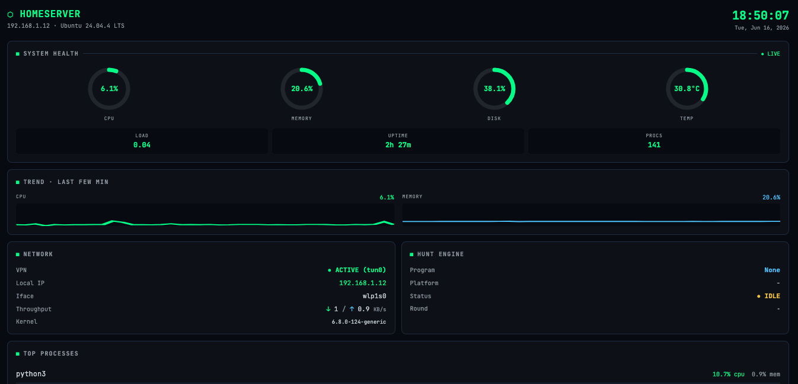

# Homeserver Dashboard
Homeserver Dashboard is a self-hosted web app that monitors a 24/7 Ubuntu server in real time — CPU, memory, disk, temperature, network throughput, running processes, scheduled jobs, and VPN status — and pushes phone alerts the moment something goes wrong (disk fills up, VPN drops, a scheduled job stops running). I built it to keep an eye on the infrastructure that runs my automated security research without having to SSH in to check.

How to use it: clone the repo, install Flask and psutil, set your ntfy topic in config.py, then either run python3 dashboard.py or install it as a systemd service so it auto-starts on boot. Open http://<your-server-ip>:5000 in any browser on your local network. Add the monitor script to cron for push alerts.


A lightweight, real-time monitoring dashboard for a self-hosted Linux 
server. Built to keep an eye on a 24/7 Ubuntu box at a glance — system 
health, network throughput, running processes, scheduled-job health, and 
VPN status — with push alerts when something needs attention.



## Why I built this

I run automated security research overnight on a Linux homeserver — cron 
jobs that scan, crawl, and probe, plus a VPN that needs to stay up the 
whole time. I was constantly SSHing in to check whether everything was 
still running and the box wasn't overheating. This dashboard puts all of 
it on one screen at `http://<server-ip>:5000`, and the companion monitor 
script pushes a notification to my phone the moment something breaks — so 
I only need to look when there's actually a problem.

## What it shows

- Live gauges for CPU, memory, disk, and temperature (auto-refresh every 
5s)
- Rolling CPU and memory trend sparklines
- Real-time network throughput (down / up KB/s)
- Top processes by CPU usage
- Scheduled-job (cron) health with last-run timestamps and staleness 
detection
- VPN interface detection (`tun*`, `wg*`, `nordlynx*`)
- Push alerts via [ntfy](https://ntfy.sh) on state changes: 
disk/temp/memory thresholds, VPN down, stale jobs. Alerts fire only on 
transitions — no spam, and a recovery ping when things clear.

## Stack

- **Backend:** Python 3, Flask, 
[psutil](https://github.com/giampaolo/psutil)
- **Frontend:** Vanilla JavaScript with SVG gauges and sparklines — no 
build step, no framework
- **Deployment:** systemd service, auto-starts on boot
- **Alerts:** ntfy via Python stdlib `urllib` (no extra dependency)

## Setup

```bash
git clone https://github.com/joshpower32/homeserver-dashboard.git
cd homeserver-dashboard

# Install dependencies
pip install -r requirements.txt

# Configure your alert channel
cp config.example.py config.py
# edit config.py and set NTFY_TOPIC to your own topic

# Run
python3 dashboard.py
```

Open `http://<your-server-ip>:5000` in any browser on your local network.

### Run on boot (systemd)

Edit `dashboard.service` so the `User=` and paths match your install 
location, then:

```bash
sudo cp dashboard.service /etc/systemd/system/
sudo systemctl daemon-reload
sudo systemctl enable --now dashboard
sudo systemctl status dashboard
```

### Health alerts (cron)

```bash
crontab -e
# add a line like:
*/10 * * * * /usr/bin/python3 /full/path/to/dashboard_monitor.py >> 
/full/path/to/monitor.log 2>&1
```

The monitor compares current state against the last-seen state stored in 
`.monitor_state.json` and only pushes when something changes (healthy → 
bad, or bad → recovered). Default thresholds: disk ≥ 90%, temp ≥ 78°C, 
memory ≥ 92%. Adjust in `dashboard_monitor.py`.

### Customizing the cron-health card

The "Cron Jobs" card on the dashboard checks the modification time of each 
job's log file. Edit the `CRON_JOBS` list in `dashboard.py` to point at 
your own log files, and make sure your crontab entries redirect output to 
those files with `>> /path/to/job.log 2>&1`.

## Security notes

This dashboard has no authentication and is designed for a **trusted LAN 
only**. Do not expose it to the public internet. A few notes on the 
choices:

- The Flask app binds to `0.0.0.0:5000`, which means anyone on the LAN can 
hit it. If that's not what you want, change the bind address in 
`dashboard.py`.
- The systemd unit runs as an unprivileged user, not root.
- `config.py` is gitignored. Your ntfy topic is effectively a shared 
secret — anyone who knows the string can read and publish to the channel — 
so it must never be committed.
- This is a development server (`flask run`), not a production WSGI 
server. For LAN use that's fine, but if you want hardening, put it behind 
nginx + basic auth.

## License

MIT. See `LICENSE`.
